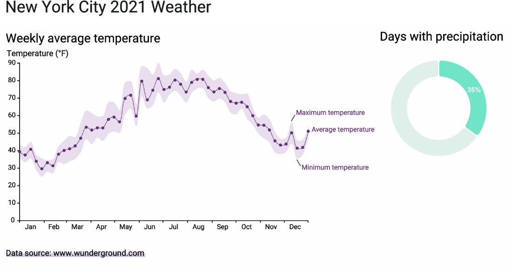

# Drawing lines, curves, and arcs

This folder contains the exercise files for chapter 4 of [D3.js in Action, 3rd edition](https://www.manning.com/books/d3js-in-action-third-edition).

The target is buidling the following visualization:

The folder is separated into subfolders corresponding to each section of the chapter. In these subfolders, you'll find a *start* and an *end* folder. To follow along with the book's instructions, write your code in the *start* folder. You'll find the solution in the *end* folder if ever you get stuck.
When changing to the next section, you can choose to keep coding in the same files or use the *start* folder for that section.

## Sections in this chapter

* [4.1-Margin_convention_and_axes](https://github.com/d3js-in-action-third-edition/code-files/tree/main/chapter_04/4.1-Margin_convention_and_axes)
* [4.2-Drawing_a_line_chart](https://github.com/d3js-in-action-third-edition/code-files/tree/main/chapter_04/4.2-Drawing_a_line_chart)
* [4.3-Drawing_an_area](https://github.com/d3js-in-action-third-edition/code-files/tree/main/chapter_04/4.3-Drawing_an_area)
* [4.4-Drawing_arcs](https://github.com/d3js-in-action-third-edition/code-files/tree/main/chapter_04/4.4-Drawing_arcs)

## How to run the project

To run this project, you'll need a local webserver. We recommend using [VS Code](https://code.visualstudio.com/)'s Live Server extension. You can find instructions on installing this extension in Appendix A of the book.

1. Open the project folder (a *start* OR an *end* folder from the subsections mentioned above) in VS Code.
2. To run the project with the Live Server extension, click the *Go live* button in the status bar of VS Code.
3. The project should open automatically in your browser.

## Structure of the project

* The `/data` folder contains two CSV files:
  * `weekly_temperature.csv` with the average weekly temperature in New York City in 2021. The columns are organized as follows:
    * `date`: The date (YEAR-MONTH-DAY).
    * `max_temp_F`: The average daily maximum temperature for that week, in Fahrenheit.
    * `avg_temp_F`: The average daily temperature for that week, in Fahrenheit.
    * `min_temp_F`: The average daily minimum temperature for that week, in Fahrenheit.
  * `daily_precipitations.csv` with the daily precipitations in New York City in 2021. The columns are organized as follows:
    * `date`: The date (YEAR-MONTH-DAY).
    * `total_precip_in`: The total daily precipitations in inches.
* The `/css` folder contains two CSS files:
  * `base.css` consists of the generic styles applied to the project page, like the font, spacings, and colors. Although you won’t need to edit this file, feel free to personalize it!
  * `visualization.css` is where we will add styles for our visualizations. It already contains the style properties applied to responsive SVG containers, following the strategy described in chapter 1.
* The `/js` folder contains two JavaScript files. Since we will work on two different charts, separating our code into multiple files will make it easier to understand, write and maintain.
  * `line-chart.js` is where you'll create the line chart.
  * `arcs.js` is where you'll draw the arcs of a donut chart.
* `index.html` contains the markup and text that composes the project. The D3 library, the CSS files, and the JavaScript files are already loaded in `index.html`.

Happy D3 coding! 🤓
